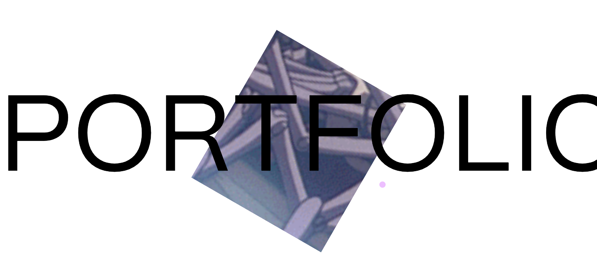
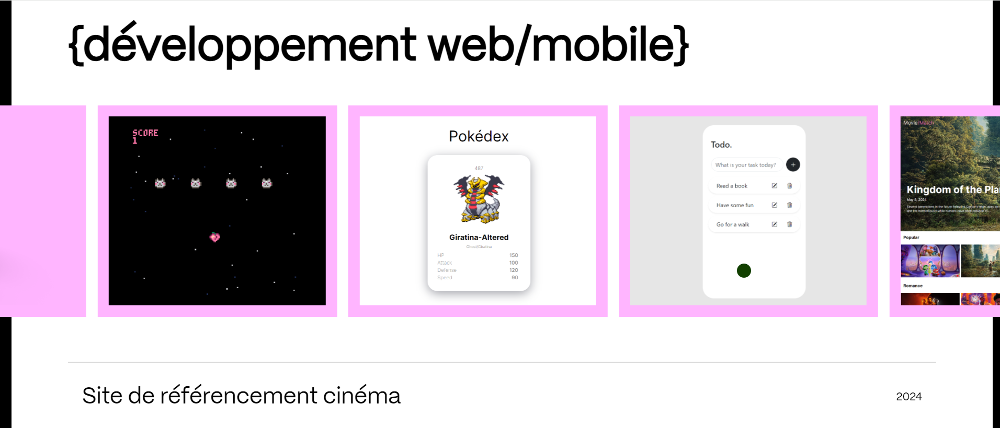
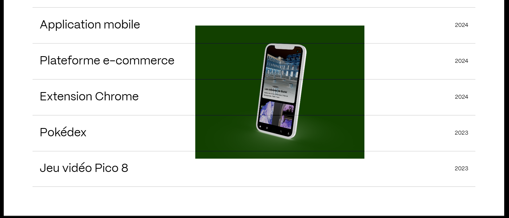
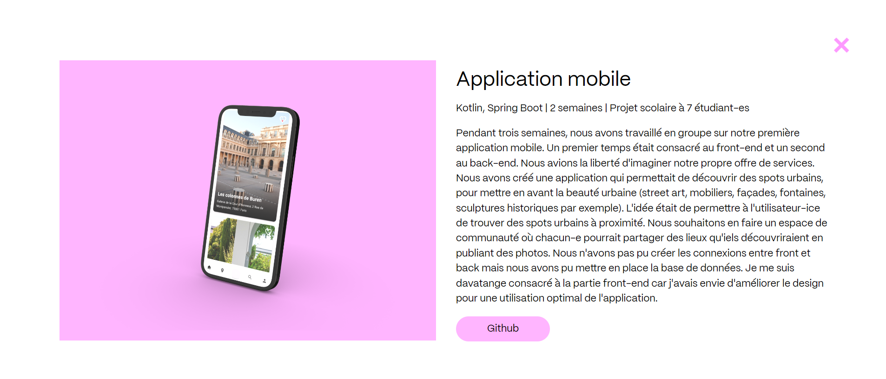

## Dossier numérique

Portfolio pour candidature au DNMADE Parcours numérique de l'école des Gobelins, pour la rentrée de septembre 2024.

## Fonctions

- Présentation de mon parcours multimédia en cinéma
- Présentations des projets de développement d'applications web et mobile

## Technologies

- HTML
- CSS
- JavaScript
- GSAP + ScrollTrigger

## Utilisation

Suivez ce lien pour découvrir le site :

https://apolline-diaz.github.io/dossier-numerique/

